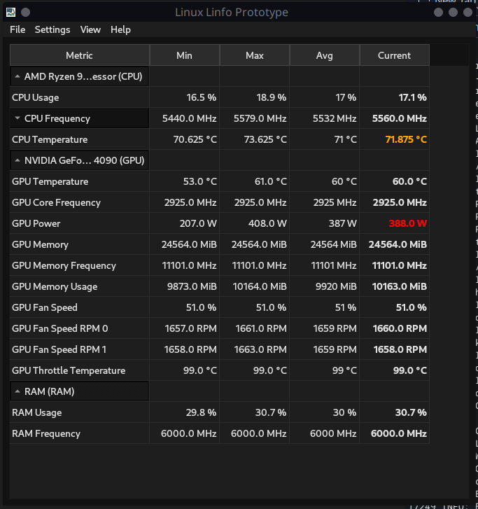
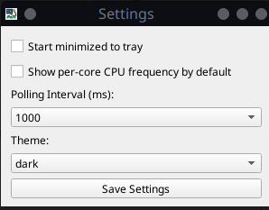

# Linfo

**Linfo** is a sleek, responsive hardware monitoring tool for Linux, built with Python and PyQt6. It shows real-time system stats like CPU usage, temperatures, RAM, and GPU data, all inside a GUI with tray integration and dark mode support.

---

## 🔧 Features

- 🖥️ Real-time CPU, GPU, RAM monitoring
- 🌡️ Temperature and frequency tracking
- 📊 Per-core CPU frequency breakdown
- 🧪 Adjustable polling intervals
- 🌙 Dark & Light theme support
- 🛠️ Works with X11 and Wayland (via AyatanaAppIndicator)
- 🔒 Elevates with `pkexec` if not run as root

---

## 📸 Screenshots




---

## 🚀 Installation

Clone this repo and run `install.py` to create a desktop entry and launch the app:

```bash
git clone https://github.com/meatsack-sudo/linfo.git
cd linfo
chmod +x install.py
python3 install.py
```

Install.py should handle dependencies but if not, ensure you install everything in requirements.txt:
```bash
sudo apt install python3-pyqt6 python3-psutil dmidecode
```

---

## ⚙️ Usage

Run the application:
```bash
python3 hwtop.py
```

Or use the `.desktop` launcher from your app menu once installed by searching for "linfo"

---

## 🧩 Configuration

- Open the **Settings** window from the tray or menu bar.
- Choose between **dark** or **light** themes.
- Enable per-core CPU frequency view.
- Customize polling interval.
- Decide whether to start minimized.

Changes are saved automatically and applied on next run.

---

## 💡 Roadmap

- [ ] Graphing history for metrics
- [ ] Export stats to CSV or JSON
- [ ] Alerts on high temperatures
- [ ] AMD/Intel GPU support beyond `nvidia-smi`

---

## 📜 License

MIT License

Copyright (c) 2025 Alex England

Permission is hereby granted, free of charge, to any person obtaining a copy
of this software and associated documentation files (the "Software"), to deal
in the Software without restriction, including without limitation the rights
to use, copy, modify, merge, publish, distribute, sublicense, and/or sell
copies of the Software, and to permit persons to whom the Software is
furnished to do so, subject to the following conditions:

The above copyright notice and this permission notice shall be included in all
copies or substantial portions of the Software.

THE SOFTWARE IS PROVIDED "AS IS", WITHOUT WARRANTY OF ANY KIND, EXPRESS OR
IMPLIED, INCLUDING BUT NOT LIMITED TO THE WARRANTIES OF MERCHANTABILITY,
FITNESS FOR A PARTICULAR PURPOSE AND NONINFRINGEMENT. IN NO EVENT SHALL THE
AUTHORS OR COPYRIGHT HOLDERS BE LIABLE FOR ANY CLAIM, DAMAGES OR OTHER
LIABILITY, WHETHER IN AN ACTION OF CONTRACT, TORT OR OTHERWISE, ARISING FROM,
OUT OF OR IN CONNECTION WITH THE SOFTWARE OR THE USE OR OTHER DEALINGS IN THE
SOFTWARE.


---

## 👨‍💻 Author

Developed by [Alex England](https://github.com/meatsack-sudo)

